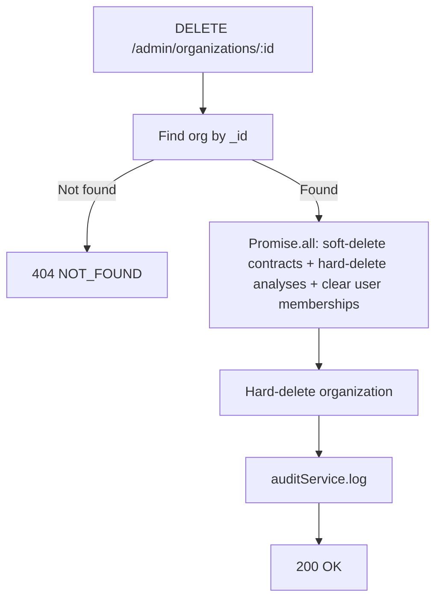

# Design Document: Admin Delete API

## Overview

This feature adds four new admin-only DELETE endpoints to the existing admin API surface. The endpoints allow platform administrators to perform privileged delete operations that bypass normal org-scoped ownership checks.

The design follows the existing admin controller patterns exactly: named exports, `asyncWrapper`, `sendSuccess`/`sendError`, and `auditService.log` after every successful mutation. No new middleware, no new services, no new utilities are introduced — only new handler functions and route registrations.

### Endpoints Summary

| Method | Path | Delete Type | Side Effects |
|--------|------|-------------|--------------|
| DELETE | `/api/v1/admin/contracts/:id` | Hard delete | Decrement org `contractCount` |
| DELETE | `/api/v1/admin/organizations/:id` | Hard delete | Soft-delete contracts, hard-delete analyses, clear user org membership |
| DELETE | `/api/v1/admin/analyses/:id` | Hard delete | None |
| DELETE | `/api/v1/admin/templates/:id` | Soft delete (`isActive: false`) | None |

---

## Architecture

All four endpoints slot into the existing admin module without structural changes. The flow is identical to the existing `deactivateUser` handler:

```
HTTP Request
    → authenticate (JWT validation)
    → authorize('admin') (role check)
    → rateLimiter('strict') (5 req / 15 min)
    → asyncWrapper(handler)
        → find resource by _id (no org-scope filter)
        → 404 if not found
        → perform delete operation(s)
        → auditService.log(...)
        → sendSuccess(res, ...)
```

The organization delete is the only handler with a cascade — it runs multiple write operations. These are executed with `Promise.all` where order doesn't matter (parallel), and sequentially where order matters (org deleted last, after cascade is complete).



---

## Components and Interfaces

### Admin Controller — New Handlers

Four new named exports added to `src/controllers/admin.controller.js`:

```js
export async function deleteContract(req, res)
export async function deleteOrganization(req, res)
export async function deleteAnalysis(req, res)
export async function deleteTemplate(req, res)
```

Each handler follows this interface contract:

- **Input**: `req.params.id` (resource ObjectId), `req.user.userId` (acting admin), `req.ip`, `req.headers['user-agent']`
- **Output**: `sendSuccess` or `sendError` via `apiResponse.js`
- **Error propagation**: thrown errors bubble up through `asyncWrapper` to the global error handler

### Admin Router — New Route Registrations

Four new lines added to `src/routes/admin.routes.js` (all covered by the existing router-level middleware):

```js
router.delete('/contracts/:id',     asyncWrapper(adminController.deleteContract));
router.delete('/organizations/:id', asyncWrapper(adminController.deleteOrganization));
router.delete('/analyses/:id',      asyncWrapper(adminController.deleteAnalysis));
router.delete('/templates/:id',     asyncWrapper(adminController.deleteTemplate));
```

### Models Used

| Model | Operation | Fields Written |
|-------|-----------|----------------|
| `Contract` | `findByIdAndDelete` | — |
| `Contract` | `updateMany` | `isDeleted`, `deletedAt` |
| `Organization` | `findByIdAndDelete` | — |
| `Organization` | `findByIdAndUpdate` | `contractCount` (`$inc: -1`) |
| `Analysis` | `findByIdAndDelete` | — |
| `Analysis` | `deleteMany` | — |
| `Template` | `findByIdAndUpdate` | `isActive` |
| `User` | `updateMany` | `organization`, `role` |

---

## Data Models

No schema changes are required. All fields used by the new endpoints already exist:

**Contract** — `isDeleted: Boolean`, `deletedAt: Date`, `orgId: ObjectId` ✓  
**Organization** — `contractCount: Number`, `members: [{ userId }]` ✓  
**Analysis** — `orgId: ObjectId` ✓  
**Template** — `isActive: Boolean` ✓  
**User** — `organization: ObjectId`, `role: String` ✓  

### Key Query Patterns

```js
// deleteContract: unscoped lookup + hard delete
const contract = await Contract.findById(id);
await Contract.findByIdAndDelete(id);
await Organization.findByIdAndUpdate(contract.orgId, { $inc: { contractCount: -1 } });

// deleteOrganization: cascade
const org = await Organization.findById(id);
await Promise.all([
  Contract.updateMany({ orgId: id }, { isDeleted: true, deletedAt: new Date() }),
  Analysis.deleteMany({ orgId: id }),
  User.updateMany({ organization: id }, { $unset: { organization: '' }, $set: { role: 'viewer' } }),
]);
await Organization.findByIdAndDelete(id);

// deleteAnalysis: unscoped hard delete
await Analysis.findByIdAndDelete(id);

// deleteTemplate: soft delete — only active templates
const template = await Template.findOne({ _id: id, isActive: true });
await Template.findByIdAndUpdate(id, { isActive: false });
```

---

## Correctness Properties

*A property is a characteristic or behavior that should hold true across all valid executions of a system — essentially, a formal statement about what the system should do. Properties serve as the bridge between human-readable specifications and machine-verifiable correctness guarantees.*

### Property 1: Contract hard-delete removes the document

*For any* existing Contract document, after `deleteContract` executes successfully, `Contract.findById(id)` SHALL return `null`.

**Validates: Requirements 2.3**

---

### Property 2: Contract deletion decrements org contractCount

*For any* Organization with `contractCount` N and any Contract belonging to that org, after `deleteContract` executes successfully, the Organization's `contractCount` SHALL equal N − 1.

**Validates: Requirements 2.4**

---

### Property 3: Org deletion soft-deletes all member contracts

*For any* Organization with any number of Contract documents, after `deleteOrganization` executes successfully, every Contract that had `orgId` equal to that org's `_id` SHALL have `isDeleted: true` and a non-null `deletedAt` timestamp.

**Validates: Requirements 3.3**

---

### Property 4: Org deletion hard-deletes all member analyses

*For any* Organization with any number of Analysis documents, after `deleteOrganization` executes successfully, `Analysis.find({ orgId })` SHALL return an empty array.

**Validates: Requirements 3.4**

---

### Property 5: Org hard-delete removes the organization document

*For any* existing Organization document, after `deleteOrganization` executes successfully, `Organization.findById(id)` SHALL return `null`.

**Validates: Requirements 3.5**

---

### Property 6: Org deletion clears all member user associations

*For any* Organization with any number of member Users, after `deleteOrganization` executes successfully, every User whose `organization` field referenced that org's `_id` SHALL have `organization: null` (or unset) and `role: 'viewer'`.

**Validates: Requirements 3.6**

---

### Property 7: Analysis hard-delete removes the document

*For any* existing Analysis document, after `deleteAnalysis` executes successfully, `Analysis.findById(id)` SHALL return `null`.

**Validates: Requirements 4.3**

---

### Property 8: Template soft-delete sets isActive to false

*For any* active Template document (`isActive: true`), after `deleteTemplate` executes successfully, the Template document SHALL have `isActive: false`.

**Validates: Requirements 5.3**

---

### Property 9: Every successful admin delete operation produces an audit log entry

*For any* successful invocation of any of the four delete handlers, the AuditLog collection SHALL contain exactly one new entry with the correct `action`, `resourceType`, and `resourceId` matching the deleted resource.

**Validates: Requirements 2.5, 3.7, 4.4, 5.4**

---

## Error Handling

All handlers use `asyncWrapper` — no try/catch blocks in handler code. Errors thrown by Mongoose or application logic propagate to the global error handler in `src/middleware/errorHandler.middleware.js`.

### Per-handler error cases

| Condition | Response |
|-----------|----------|
| Resource not found | `sendError(res, { statusCode: 404, code: 'NOT_FOUND', message: '...' })` |
| Template already inactive | `sendError(res, { statusCode: 404, code: 'NOT_FOUND', message: 'Template not found.' })` |
| Invalid ObjectId format | Mongoose `CastError` → global handler → 400 |
| Unexpected DB error | Mongoose error → global handler → 500 `INTERNAL_ERROR` |
| No JWT | `authenticate` middleware → 401 `UNAUTHORIZED` |
| Non-admin role | `authorize('admin')` middleware → 403 `FORBIDDEN` |
| Rate limit exceeded | `rateLimiter('strict')` middleware → 429 |

### Audit log failures

`auditService.log` swallows its own errors internally (existing behavior). A failed audit write will never cause the delete operation to fail or return an error response.

### Organization cascade partial failure

If one of the cascade operations in `deleteOrganization` throws (e.g., a DB timeout during `Analysis.deleteMany`), the error propagates through `asyncWrapper` and the entire request fails with 500. The cascade is not atomic — some writes may have already completed. This is an acceptable trade-off given the admin-only, low-frequency nature of this operation. A future improvement could wrap the cascade in a MongoDB transaction.

---

## Testing Strategy

### Unit Tests (example-based)

Each handler should have unit tests covering:

- **Happy path**: resource exists → correct delete operation → correct audit log call → correct response shape
- **Not found**: non-existent ID → 404 + `NOT_FOUND` code
- **Template already inactive**: `isActive: false` → 404 (same as not found)
- **Auth/authz**: no token → 401, non-admin token → 403 (middleware tests, shared across all endpoints)

Use `jest` with `mongodb-memory-server` for in-memory MongoDB, consistent with the existing test setup (`jest.config.cjs`).

### Property-Based Tests

Use `fast-check` for property-based testing. Each property test runs a minimum of 100 iterations.

**Property 1 — Contract hard-delete removes the document**
```
// Feature: admin-delete-api, Property 1: contract hard-delete removes the document
fc.assert(fc.asyncProperty(fc.record({ title: fc.string(), ... }), async (contractData) => {
  const contract = await Contract.create({ ...contractData, orgId, uploadedBy });
  await deleteContract({ params: { id: contract._id }, user: { userId: adminId }, ip, headers });
  expect(await Contract.findById(contract._id)).toBeNull();
}), { numRuns: 100 });
```

**Property 2 — contractCount decrements by 1**
```
// Feature: admin-delete-api, Property 2: contract deletion decrements org contractCount
// Generate org with random contractCount N, create a contract, delete it, verify N-1
```

**Property 3 — Org deletion soft-deletes all contracts**
```
// Feature: admin-delete-api, Property 3: org deletion soft-deletes all member contracts
// Generate org with 1..20 contracts, delete org, verify all contracts have isDeleted: true
```

**Property 4 — Org deletion hard-deletes all analyses**
```
// Feature: admin-delete-api, Property 4: org deletion hard-deletes all member analyses
// Generate org with 0..10 analyses, delete org, verify Analysis.find({orgId}) is empty
```

**Property 5 — Org hard-delete removes the org document**
```
// Feature: admin-delete-api, Property 5: org hard-delete removes the organization document
```

**Property 6 — Org deletion clears user associations**
```
// Feature: admin-delete-api, Property 6: org deletion clears all member user associations
// Generate org with 1..10 member users, delete org, verify all users have organization: null, role: 'viewer'
```

**Property 7 — Analysis hard-delete removes the document**
```
// Feature: admin-delete-api, Property 7: analysis hard-delete removes the document
```

**Property 8 — Template soft-delete sets isActive: false**
```
// Feature: admin-delete-api, Property 8: template soft-delete sets isActive to false
// Generate active templates with varying fields, soft-delete, verify isActive: false
```

**Property 9 — Audit log entry created for every delete**
```
// Feature: admin-delete-api, Property 9: every successful admin delete produces an audit log entry
// For each of the 4 handlers, generate a resource, delete it, verify AuditLog contains correct entry
```

### Integration Tests

- Verify the four routes are registered and reachable (smoke test against a running server or supertest)
- Verify the middleware chain (auth, authz, rate limiter) is applied — call each endpoint without a token and with a non-admin token
