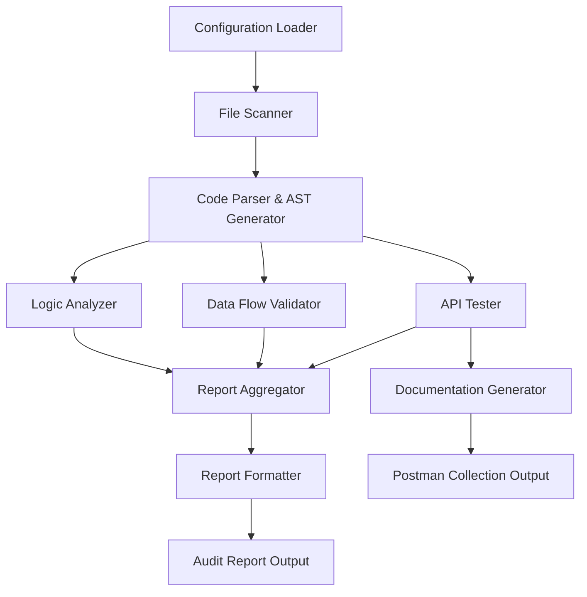
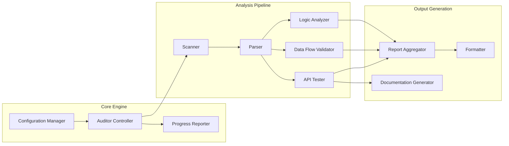
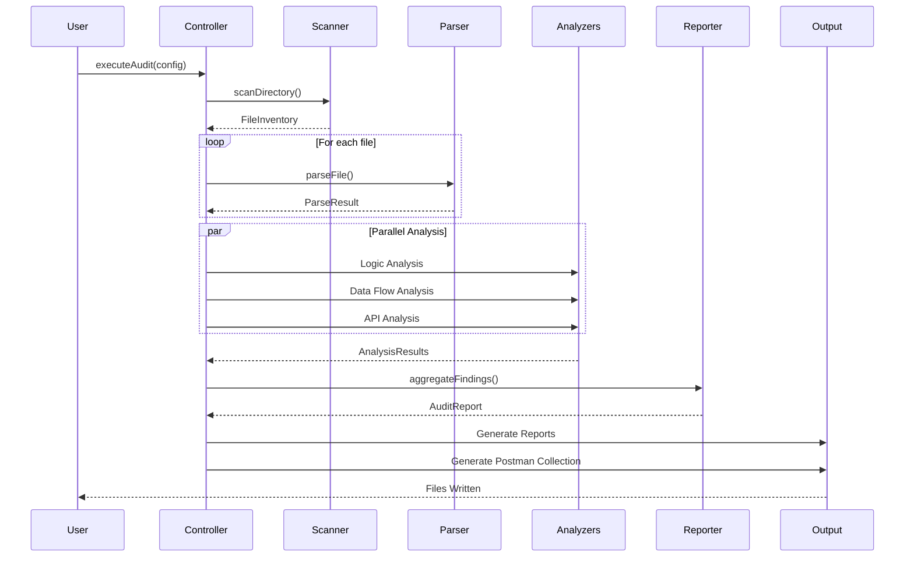

# Design Document: Master Codebase Auditor & Tester

## Overview

The Master Codebase Auditor & Tester is a comprehensive static analysis and validation system for Node.js/Express backend applications. The system performs multi-layered analysis including code quality auditing, data flow validation, API functional testing, and automated documentation generation.

### Core Objectives

1. **Code Quality Assurance**: Identify incomplete implementations, logic errors, and anti-patterns
2. **Data Integrity Validation**: Verify database operations align with schema definitions
3. **API Correctness**: Validate endpoint functionality, middleware chains, and response contracts
4. **Documentation Automation**: Generate Postman collections for discovered API endpoints
5. **Actionable Reporting**: Provide severity-classified findings with remediation guidance

### Key Features

- Recursive codebase scanning with configurable ignore patterns
- AST-based code analysis for deep logic inspection
- MongoDB/Mongoose schema discovery and validation
- Express route discovery and middleware chain analysis
- Automated Postman collection generation with sample payloads
- Multi-format reporting (JSON, Markdown, HTML)
- Configurable severity classification and check selection

### Target Environment

- **Runtime**: Node.js (v14+)
- **Framework**: Express.js
- **Database**: MongoDB with Mongoose ODM
- **Message Queue**: RabbitMQ
- **Cache**: Redis
- **Real-time**: Socket.io

## Architecture

### System Architecture

The system follows a pipeline architecture with five primary stages:



### Component Architecture



### Design Principles

1. **Separation of Concerns**: Each analyzer focuses on a specific domain (logic, data, API)
2. **Fail-Safe Operation**: Individual file failures don't halt the entire audit
3. **Extensibility**: Plugin architecture allows adding new analyzers
4. **Performance**: Parallel processing where possible, streaming for large files
5. **Configurability**: All checks, severities, and outputs are configurable

## Components and Interfaces

### 1. Configuration Manager

**Responsibility**: Load and validate configuration settings

**Interface**:
```javascript
class ConfigurationManager {
  /**
   * Load configuration from file or use defaults
   * @param {string} configPath - Path to config file
   * @returns {Configuration} Validated configuration object
   */
  loadConfiguration(configPath)
  
  /**
   * Validate configuration structure and values
   * @param {object} config - Raw configuration object
   * @returns {boolean} True if valid
   * @throws {ConfigurationError} If invalid
   */
  validateConfiguration(config)
  
  /**
   * Get default configuration for Node.js/Express projects
   * @returns {Configuration} Default configuration
   */
  getDefaultConfiguration()
}
```

**Configuration Schema**:
```javascript
{
  scan: {
    rootDirectory: string,
    includePatterns: string[],
    excludePatterns: string[],
    fileExtensions: string[]
  },
  checks: {
    incompleteFunctions: boolean,
    todoMarkers: boolean,
    edgeCases: boolean,
    logicErrors: boolean,
    variableValidation: boolean,
    dataFlowValidation: boolean,
    apiValidation: boolean
  },
  severity: {
    syntaxError: 'CRITICAL' | 'HIGH' | 'MEDIUM' | 'LOW',
    missingErrorHandling: 'CRITICAL' | 'HIGH' | 'MEDIUM' | 'LOW',
    incompleteFunctions: 'CRITICAL' | 'HIGH' | 'MEDIUM' | 'LOW',
    todoMarkers: 'CRITICAL' | 'HIGH' | 'MEDIUM' | 'LOW',
    unusedVariables: 'CRITICAL' | 'HIGH' | 'MEDIUM' | 'LOW'
  },
  output: {
    directory: string,
    formats: ('json' | 'markdown' | 'html')[],
    generatePostman: boolean
  }
}
```

### 2. File Scanner

**Responsibility**: Discover and catalog all files in the codebase

**Interface**:
```javascript
class FileScanner {
  /**
   * Recursively scan directory for files
   * @param {string} rootPath - Starting directory
   * @param {ScanOptions} options - Include/exclude patterns
   * @returns {Promise<FileInventory>} List of discovered files
   */
  async scanDirectory(rootPath, options)
  
  /**
   * Check if file should be included based on patterns
   * @param {string} filePath - File to check
   * @param {ScanOptions} options - Include/exclude patterns
   * @returns {boolean} True if file should be analyzed
   */
  shouldIncludeFile(filePath, options)
  
  /**
   * Determine file type based on extension and content
   * @param {string} filePath - File to classify
   * @returns {FileType} Classification result
   */
  classifyFile(filePath)
}
```

### 3. Code Parser

**Responsibility**: Parse source code into Abstract Syntax Trees

**Interface**:
```javascript
class CodeParser {
  /**
   * Parse JavaScript/TypeScript file into AST
   * @param {string} filePath - File to parse
   * @param {string} content - File content
   * @returns {Promise<ParseResult>} AST and metadata
   */
  async parseFile(filePath, content)
  
  /**
   * Extract all function declarations from AST
   * @param {AST} ast - Abstract syntax tree
   * @returns {FunctionDeclaration[]} List of functions
   */
  extractFunctions(ast)
  
  /**
   * Extract all class definitions from AST
   * @param {AST} ast - Abstract syntax tree
   * @returns {ClassDeclaration[]} List of classes
   */
  extractClasses(ast)
  
  /**
   * Extract all import/export statements
   * @param {AST} ast - Abstract syntax tree
   * @returns {ImportExport[]} List of imports and exports
   */
  extractImportsExports(ast)
}
```

### 4. Logic Analyzer

**Responsibility**: Analyze code for completeness, correctness, and quality issues

**Interface**:
```javascript
class LogicAnalyzer {
  /**
   * Analyze parsed file for logic issues
   * @param {ParseResult} parseResult - Parsed file data
   * @param {Configuration} config - Analysis configuration
   * @returns {Promise<LogicIssue[]>} List of detected issues
   */
  async analyzeFile(parseResult, config)
  
  /**
   * Detect incomplete function implementations
   * @param {FunctionDeclaration[]} functions - Functions to check
   * @returns {Issue[]} Incomplete functions
   */
  detectIncompleteFunctions(functions)
  
  /**
   * Find TODO/FIXME/HACK markers in comments
   * @param {Comment[]} comments - All comments in file
   * @returns {Issue[]} Found markers
   */
  detectTodoMarkers(comments)
  
  /**
   * Check for missing edge case handling
   * @param {FunctionDeclaration} func - Function to analyze
   * @returns {Issue[]} Missing validations
   */
  detectMissingEdgeCases(func)
  
  /**
   * Detect common logic errors and anti-patterns
   * @param {AST} ast - Abstract syntax tree
   * @returns {Issue[]} Logic errors
   */
  detectLogicErrors(ast)
  
  /**
   * Validate variable declarations and usage
   * @param {AST} ast - Abstract syntax tree
   * @returns {Issue[]} Variable issues
   */
  validateVariables(ast)
}
```

### 5. Data Flow Validator

**Responsibility**: Validate database operations and schema consistency

**Interface**:
```javascript
class DataFlowValidator {
  /**
   * Discover all Mongoose models in codebase
   * @param {FileInventory} files - All files to search
   * @returns {Promise<DataModelRegistry>} Discovered models
   */
  async discoverModels(files)
  
  /**
   * Validate database write operations
   * @param {ParseResult} parseResult - Parsed file
   * @param {DataModelRegistry} models - Known models
   * @returns {Issue[]} Validation issues
   */
  validateWriteOperations(parseResult, models)
  
  /**
   * Validate database read operations
   * @param {ParseResult} parseResult - Parsed file
   * @param {DataModelRegistry} models - Known models
   * @returns {Issue[]} Validation issues
   */
  validateReadOperations(parseResult, models)
  
  /**
   * Check if query uses valid field names
   * @param {QueryObject} query - Query to validate
   * @param {DataModel} model - Target model
   * @returns {boolean} True if valid
   */
  validateQueryFields(query, model)
  
  /**
   * Validate population references
   * @param {PopulateCall} populate - Populate operation
   * @param {DataModelRegistry} models - Known models
   * @returns {Issue[]} Invalid references
   */
  validatePopulation(populate, models)
}
```

### 6. API Tester

**Responsibility**: Discover and validate API endpoints

**Interface**:
```javascript
class APITester {
  /**
   * Discover all Express routes in codebase
   * @param {FileInventory} files - All files to search
   * @returns {Promise<APIEndpoint[]>} Discovered endpoints
   */
  async discoverEndpoints(files)
  
  /**
   * Validate middleware chain for endpoint
   * @param {APIEndpoint} endpoint - Endpoint to validate
   * @returns {Issue[]} Middleware issues
   */
  validateMiddleware(endpoint)
  
  /**
   * Validate response handling in route handler
   * @param {RouteHandler} handler - Handler function
   * @returns {Issue[]} Response issues
   */
  validateResponseHandling(handler)
  
  /**
   * Validate handler logic completeness
   * @param {RouteHandler} handler - Handler function
   * @returns {Issue[]} Logic issues
   */
  validateHandlerLogic(handler)
  
  /**
   * Check if handler returns correct status codes
   * @param {RouteHandler} handler - Handler function
   * @returns {Issue[]} Status code issues
   */
  validateStatusCodes(handler)
}
```

### 7. Documentation Generator

**Responsibility**: Generate Postman collections from discovered APIs

**Interface**:
```javascript
class DocumentationGenerator {
  /**
   * Generate Postman collection from endpoints
   * @param {APIEndpoint[]} endpoints - Discovered endpoints
   * @param {DataModelRegistry} models - Known models for body generation
   * @returns {PostmanCollection} Postman v2.1 collection
   */
  generatePostmanCollection(endpoints, models)
  
  /**
   * Generate sample request body for endpoint
   * @param {APIEndpoint} endpoint - Endpoint requiring body
   * @param {DataModel} model - Associated model
   * @returns {object} Sample JSON body
   */
  generateRequestBody(endpoint, model)
  
  /**
   * Generate authentication configuration
   * @param {APIEndpoint[]} endpoints - All endpoints
   * @returns {AuthConfig} Postman auth configuration
   */
  generateAuthConfig(endpoints)
  
  /**
   * Generate sample values for model fields
   * @param {ModelField} field - Field definition
   * @returns {any} Sample value matching field type
   */
  generateSampleValue(field)
}
```

### 8. Report Aggregator

**Responsibility**: Collect and organize all findings

**Interface**:
```javascript
class ReportAggregator {
  /**
   * Aggregate issues from all analyzers
   * @param {AnalysisResults} results - Results from all analyzers
   * @returns {AuditReport} Structured report
   */
  aggregateFindings(results)
  
  /**
   * Classify issue severity
   * @param {Issue} issue - Issue to classify
   * @param {Configuration} config - Severity configuration
   * @returns {Severity} Assigned severity level
   */
  classifySeverity(issue, config)
  
  /**
   * Group issues by category and severity
   * @param {Issue[]} issues - All issues
   * @returns {GroupedIssues} Organized issues
   */
  groupIssues(issues)
  
  /**
   * Generate summary statistics
   * @param {Issue[]} issues - All issues
   * @returns {Summary} Count by type and severity
   */
  generateSummary(issues)
}
```

### 9. Report Formatter

**Responsibility**: Format audit reports in various output formats

**Interface**:
```javascript
class ReportFormatter {
  /**
   * Format report as JSON
   * @param {AuditReport} report - Report to format
   * @returns {string} JSON string
   */
  formatAsJSON(report)
  
  /**
   * Format report as Markdown
   * @param {AuditReport} report - Report to format
   * @returns {string} Markdown string
   */
  formatAsMarkdown(report)
  
  /**
   * Format report as HTML
   * @param {AuditReport} report - Report to format
   * @returns {string} HTML string
   */
  formatAsHTML(report)
  
  /**
   * Write formatted report to file
   * @param {string} content - Formatted content
   * @param {string} outputPath - Destination path
   * @returns {Promise<void>}
   */
  async writeReport(content, outputPath)
}
```

### 10. Progress Reporter

**Responsibility**: Report progress during long-running operations

**Interface**:
```javascript
class ProgressReporter {
  /**
   * Report scanning progress
   * @param {number} processed - Files processed
   * @param {number} total - Total files
   */
  reportScanProgress(processed, total)
  
  /**
   * Report analysis progress
   * @param {string} currentFile - File being analyzed
   * @param {number} processed - Files processed
   * @param {number} total - Total files
   */
  reportAnalysisProgress(currentFile, processed, total)
  
  /**
   * Report phase completion
   * @param {string} phase - Completed phase name
   * @param {number} duration - Time taken in ms
   */
  reportPhaseCompletion(phase, duration)
  
  /**
   * Report overall progress percentage
   * @param {number} percentage - Progress 0-100
   */
  reportOverallProgress(percentage)
}
```

### 11. Auditor Controller

**Responsibility**: Orchestrate the entire audit process

**Interface**:
```javascript
class AuditorController {
  /**
   * Execute complete audit process
   * @param {Configuration} config - Audit configuration
   * @returns {Promise<AuditResult>} Complete audit results
   */
  async executeAudit(config)
  
  /**
   * Handle errors during audit execution
   * @param {Error} error - Error that occurred
   * @param {string} context - Where error occurred
   * @returns {void} Logs error and continues
   */
  handleError(error, context)
  
  /**
   * Coordinate parallel analysis tasks
   * @param {ParseResult[]} parseResults - Parsed files
   * @returns {Promise<AnalysisResults>} Combined results
   */
  async coordinateAnalysis(parseResults)
}
```

## Data Models

### FileInventory

```javascript
{
  totalFiles: number,
  files: [
    {
      path: string,
      relativePath: string,
      type: 'javascript' | 'typescript' | 'json' | 'other',
      size: number,
      lastModified: Date
    }
  ]
}
```

### ParseResult

```javascript
{
  filePath: string,
  ast: object,  // Babel/TypeScript AST
  functions: [
    {
      name: string,
      type: 'function' | 'arrow' | 'method',
      params: string[],
      async: boolean,
      location: {
        start: { line: number, column: number },
        end: { line: number, column: number }
      },
      body: object  // AST node
    }
  ],
  classes: [
    {
      name: string,
      methods: object[],
      properties: object[],
      location: object
    }
  ],
  imports: [
    {
      source: string,
      specifiers: string[],
      location: object
    }
  ],
  exports: [
    {
      name: string,
      type: 'named' | 'default',
      location: object
    }
  ],
  comments: [
    {
      type: 'line' | 'block',
      value: string,
      location: object
    }
  ],
  errors: [
    {
      message: string,
      line: number,
      column: number
    }
  ]
}
```

### Issue

```javascript
{
  id: string,  // Unique identifier
  type: 'incomplete_function' | 'todo_marker' | 'missing_error_handling' | 
        'logic_error' | 'variable_issue' | 'data_flow_issue' | 'api_issue',
  severity: 'CRITICAL' | 'HIGH' | 'MEDIUM' | 'LOW',
  category: 'logic' | 'data' | 'api' | 'quality',
  file: string,
  location: {
    line: number,
    column: number,
    endLine: number,
    endColumn: number
  },
  message: string,
  description: string,
  recommendation: string,
  codeSnippet: string,
  metadata: object  // Type-specific additional data
}
```

### DataModel

```javascript
{
  name: string,
  collectionName: string,
  filePath: string,
  schema: {
    fields: [
      {
        name: string,
        type: 'String' | 'Number' | 'Boolean' | 'Date' | 'ObjectId' | 'Array' | 'Mixed',
        required: boolean,
        unique: boolean,
        default: any,
        ref: string,  // For ObjectId references
        validation: {
          min: number,
          max: number,
          minLength: number,
          maxLength: number,
          enum: any[],
          match: RegExp,
          custom: string  // Custom validator function
        }
      }
    ],
    indexes: [
      {
        fields: object,
        options: object
      }
    ],
    virtuals: string[],
    methods: string[],
    statics: string[]
  },
  relationships: [
    {
      field: string,
      targetModel: string,
      type: 'one-to-one' | 'one-to-many' | 'many-to-many'
    }
  ]
}
```

### DataModelRegistry

```javascript
{
  models: Map<string, DataModel>,
  
  /**
   * Get model by name
   * @param {string} name - Model name
   * @returns {DataModel | null}
   */
  getModel(name),
  
  /**
   * Check if field exists in model
   * @param {string} modelName - Model name
   * @param {string} fieldPath - Field path (supports dot notation)
   * @returns {boolean}
   */
  hasField(modelName, fieldPath),
  
  /**
   * Get field definition
   * @param {string} modelName - Model name
   * @param {string} fieldPath - Field path
   * @returns {ModelField | null}
   */
  getField(modelName, fieldPath)
}
```

### APIEndpoint

```javascript
{
  method: 'GET' | 'POST' | 'PUT' | 'PATCH' | 'DELETE',
  path: string,
  pathPattern: string,  // With :param placeholders
  file: string,
  location: object,
  middleware: [
    {
      name: string,
      type: 'auth' | 'validation' | 'error' | 'custom',
      function: object  // AST node
    }
  ],
  handler: {
    name: string,
    params: string[],
    async: boolean,
    function: object  // AST node
  },
  requestBody: {
    required: boolean,
    model: string,  // Associated model name
    schema: object  // Validation schema if available
  },
  responses: [
    {
      statusCode: number,
      description: string,
      schema: object
    }
  ],
  authentication: {
    required: boolean,
    type: 'bearer' | 'apiKey' | 'basic' | 'custom'
  }
}
```

### PostmanCollection

```javascript
{
  info: {
    name: string,
    description: string,
    schema: 'https://schema.getpostman.com/json/collection/v2.1.0/collection.json'
  },
  auth: {
    type: 'bearer' | 'apikey',
    bearer: [{ key: 'token', value: '{{token}}', type: 'string' }],
    apikey: [{ key: 'key', value: '{{apiKey}}', type: 'string' }]
  },
  item: [
    {
      name: string,
      request: {
        method: string,
        header: [
          { key: string, value: string, type: 'text' }
        ],
        body: {
          mode: 'raw',
          raw: string,  // JSON string
          options: {
            raw: { language: 'json' }
          }
        },
        url: {
          raw: string,
          protocol: 'http' | 'https',
          host: string[],
          path: string[],
          variable: [
            { key: string, value: string }
          ]
        },
        description: string
      },
      response: []
    }
  ],
  variable: [
    { key: string, value: string, type: 'string' }
  ]
}
```

### AuditReport

```javascript
{
  metadata: {
    timestamp: Date,
    duration: number,  // milliseconds
    configuration: Configuration,
    statistics: {
      filesScanned: number,
      filesAnalyzed: number,
      endpointsDiscovered: number,
      modelsDiscovered: number
    }
  },
  summary: {
    totalIssues: number,
    bySeverity: {
      CRITICAL: number,
      HIGH: number,
      MEDIUM: number,
      LOW: number
    },
    byCategory: {
      logic: number,
      data: number,
      api: number,
      quality: number
    },
    byType: Map<string, number>
  },
  issues: Issue[],
  groupedIssues: {
    bySeverity: {
      CRITICAL: Issue[],
      HIGH: Issue[],
      MEDIUM: Issue[],
      LOW: Issue[]
    },
    byFile: Map<string, Issue[]>,
    byType: Map<string, Issue[]>
  },
  errors: [
    {
      phase: string,
      file: string,
      error: string,
      timestamp: Date
    }
  ],
  recommendations: [
    {
      category: string,
      priority: number,
      description: string,
      affectedFiles: string[]
    }
  ]
}
```

### AnalysisResults

```javascript
{
  logicIssues: Issue[],
  dataFlowIssues: Issue[],
  apiIssues: Issue[],
  models: DataModelRegistry,
  endpoints: APIEndpoint[],
  errors: Error[]
}
```


## Implementation Approach

### Phase 1: Core Infrastructure

1. **Configuration System**
   - Implement ConfigurationManager with JSON schema validation
   - Support both file-based and programmatic configuration
   - Provide sensible defaults for Node.js/Express projects

2. **File System Operations**
   - Implement FileScanner with glob pattern support
   - Use streaming for large directory traversals
   - Implement efficient ignore pattern matching (similar to .gitignore)

3. **Progress Reporting**
   - Implement event-based progress reporting
   - Support both console and programmatic progress listeners
   - Calculate and report estimated time remaining

### Phase 2: Code Analysis Foundation

1. **Parser Integration**
   - Integrate Babel parser for JavaScript
   - Integrate TypeScript compiler API for TypeScript
   - Implement unified ParseResult abstraction
   - Handle syntax errors gracefully

2. **AST Traversal Utilities**
   - Implement visitor pattern for AST traversal
   - Create helper functions for common node type checks
   - Build scope analysis utilities for variable tracking

3. **Error Recovery**
   - Implement try-catch wrappers for all file operations
   - Log errors without halting execution
   - Collect errors for final report

### Phase 3: Logic Analysis

1. **Incomplete Function Detection**
   - Check for empty function bodies
   - Detect functions with only comments
   - Identify throw statements with "not implemented"

2. **Marker Detection**
   - Scan comments for TODO, FIXME, HACK, XXX
   - Extract marker message and context
   - Track marker locations

3. **Edge Case Detection**
   - Analyze function parameters for null/undefined checks
   - Detect missing try-catch around async operations
   - Check array operations for empty array handling
   - Verify error handling for database and API calls

4. **Logic Error Detection**
   - Detect unreachable code after returns
   - Find unused variables
   - Identify infinite loops
   - Check for assignment in conditionals
   - Find async calls without await

5. **Variable Validation**
   - Track variable declarations and usage
   - Detect undefined variable references
   - Check for const reassignment
   - Identify variable shadowing
   - Validate environment variable usage

### Phase 4: Data Flow Validation

1. **Model Discovery**
   - Scan for Mongoose schema definitions
   - Parse schema structure and validation rules
   - Build DataModelRegistry
   - Extract relationships and indexes

2. **Write Operation Validation**
   - Detect save(), create(), updateOne(), findByIdAndUpdate()
   - Validate data structure against schema
   - Check for required field population
   - Verify error handling exists

3. **Read Operation Validation**
   - Detect find(), findById(), findOne()
   - Validate query field names against schema
   - Check projection fields exist
   - Validate populate() references
   - Verify null/undefined handling for missing documents

### Phase 5: API Testing

1. **Endpoint Discovery**
   - Scan for Express Router instances
   - Extract route definitions (app.get, router.post, etc.)
   - Parse path patterns and parameters
   - Identify middleware chains

2. **Middleware Validation**
   - Classify middleware by type (auth, validation, error)
   - Verify middleware calls next() or sends response
   - Check middleware order
   - Validate authentication middleware logic

3. **Handler Validation**
   - Verify single response per handler
   - Check for unreachable code after response
   - Validate input parameter handling
   - Verify error handling for database operations

4. **Response Validation**
   - Check status code usage (200, 201, 400, 401, 403, 404)
   - Verify response payload structure
   - Validate error response format

### Phase 6: Documentation Generation

1. **Postman Collection Structure**
   - Generate collection metadata
   - Configure authentication
   - Create folder structure by resource

2. **Request Generation**
   - Generate URL with parameter placeholders
   - Add required headers
   - Generate sample request bodies from schemas

3. **Sample Data Generation**
   - Generate type-appropriate sample values
   - Respect validation rules (min, max, enum, etc.)
   - Mark optional fields
   - Handle nested objects and arrays

### Phase 7: Reporting

1. **Issue Aggregation**
   - Collect issues from all analyzers
   - Classify severity based on configuration
   - Group by severity, file, and type

2. **Summary Generation**
   - Calculate statistics
   - Generate recommendations
   - Prioritize issues

3. **Multi-Format Output**
   - Implement JSON formatter
   - Implement Markdown formatter with tables
   - Implement HTML formatter with styling
   - Write files to output directory

### Execution Flow



### Error Handling Strategy

1. **File-Level Errors**
   - Catch parse errors and continue
   - Log error with file path and line number
   - Include in error section of report

2. **Analysis Errors**
   - Wrap each analyzer in try-catch
   - Continue with remaining analyzers on failure
   - Report which analyzers failed

3. **External Dependencies**
   - Handle missing database connections gracefully
   - Skip data flow validation if models can't be discovered
   - Provide clear error messages

4. **Output Errors**
   - Verify output directory exists/is writable
   - Handle disk space issues
   - Provide fallback to console output

### Performance Considerations

1. **Parallel Processing**
   - Parse files in parallel (worker threads or Promise.all)
   - Limit concurrency to avoid memory issues
   - Use streaming for large files

2. **Caching**
   - Cache parsed ASTs for files analyzed multiple times
   - Cache model registry after discovery
   - Cache configuration after loading

3. **Memory Management**
   - Process files in batches
   - Clear AST references after analysis
   - Use generators for large result sets

4. **Optimization**
   - Skip binary files early
   - Use fast-glob for efficient file scanning
   - Minimize AST traversals (combine checks where possible)

## Technology Stack

### Core Dependencies

**Parsing and AST**
- `@babel/parser` (^7.23.0) - JavaScript parsing
- `@babel/traverse` (^7.23.0) - AST traversal
- `@babel/types` (^7.23.0) - AST node utilities
- `typescript` (^5.3.0) - TypeScript parsing and type checking

**File System**
- `fast-glob` (^3.3.0) - Fast file system scanning with glob patterns
- `ignore` (^5.3.0) - .gitignore-style pattern matching
- `fs-extra` (^11.2.0) - Enhanced file system operations

**Code Analysis**
- `eslint` (^8.56.0) - Leverage ESLint rules for logic error detection
- `eslint-scope` (^7.2.0) - Scope analysis for variable tracking

**Reporting**
- `marked` (^11.0.0) - Markdown generation
- `handlebars` (^4.7.0) - HTML template rendering
- `chalk` (^5.3.0) - Console output formatting
- `cli-progress` (^3.12.0) - Progress bar display

**Utilities**
- `lodash` (^4.17.21) - Utility functions
- `ajv` (^8.12.0) - JSON schema validation for configuration
- `uuid` (^9.0.0) - Unique ID generation for issues

### Development Dependencies

**Testing**
- `jest` (^29.7.0) - Test framework
- `@fast-check/jest` (^1.8.0) - Property-based testing
- `supertest` (^6.3.0) - API testing utilities

**Code Quality**
- `eslint` (^8.56.0) - Linting
- `prettier` (^3.1.0) - Code formatting
- `husky` (^8.0.0) - Git hooks

**Build Tools**
- `typescript` (^5.3.0) - Type checking
- `ts-node` (^10.9.0) - TypeScript execution
- `nodemon` (^3.0.0) - Development server

### Project Structure

```
codebase-auditor-tester/
├── src/
│   ├── core/
│   │   ├── AuditorController.js
│   │   ├── ConfigurationManager.js
│   │   └── ProgressReporter.js
│   ├── scanner/
│   │   ├── FileScanner.js
│   │   └── FileClassifier.js
│   ├── parser/
│   │   ├── CodeParser.js
│   │   ├── JavaScriptParser.js
│   │   └── TypeScriptParser.js
│   ├── analyzers/
│   │   ├── LogicAnalyzer.js
│   │   ├── DataFlowValidator.js
│   │   └── APITester.js
│   ├── models/
│   │   ├── DataModelRegistry.js
│   │   ├── Issue.js
│   │   └── AuditReport.js
│   ├── generators/
│   │   ├── DocumentationGenerator.js
│   │   └── SampleDataGenerator.js
│   ├── reporters/
│   │   ├── ReportAggregator.js
│   │   └── ReportFormatter.js
│   ├── utils/
│   │   ├── ASTHelpers.js
│   │   ├── ScopeAnalyzer.js
│   │   └── PatternMatcher.js
│   └── index.js
├── tests/
│   ├── unit/
│   ├── integration/
│   └── fixtures/
├── config/
│   └── default-config.json
├── templates/
│   ├── report.html.hbs
│   └── report.md.hbs
├── package.json
├── tsconfig.json
└── README.md
```

### Configuration File Format

**default-config.json**:
```json
{
  "scan": {
    "rootDirectory": ".",
    "includePatterns": ["**/*.js", "**/*.ts"],
    "excludePatterns": [
      "node_modules/**",
      ".git/**",
      "dist/**",
      "build/**",
      "coverage/**",
      "*.test.js",
      "*.spec.js"
    ],
    "fileExtensions": [".js", ".ts"]
  },
  "checks": {
    "incompleteFunctions": true,
    "todoMarkers": true,
    "edgeCases": true,
    "logicErrors": true,
    "variableValidation": true,
    "dataFlowValidation": true,
    "apiValidation": true
  },
  "severity": {
    "syntaxError": "CRITICAL",
    "missingErrorHandling": "HIGH",
    "incompleteFunctions": "HIGH",
    "todoMarkers": "MEDIUM",
    "unusedVariables": "LOW",
    "unreachableCode": "MEDIUM",
    "invalidQuery": "HIGH",
    "missingValidation": "HIGH"
  },
  "output": {
    "directory": "./audit-results",
    "formats": ["json", "markdown", "html"],
    "generatePostman": true
  },
  "database": {
    "modelPatterns": ["**/models/**/*.js", "**/schemas/**/*.js"]
  },
  "api": {
    "routePatterns": ["**/routes/**/*.js", "**/controllers/**/*.js"],
    "baseUrl": "http://localhost:3000"
  }
}
```

### CLI Interface

```bash
# Basic usage
npx codebase-auditor-tester

# With custom config
npx codebase-auditor-tester --config ./my-config.json

# Specify root directory
npx codebase-auditor-tester --root ./src

# Output format selection
npx codebase-auditor-tester --format json,markdown

# Skip specific checks
npx codebase-auditor-tester --skip todoMarkers,unusedVariables

# Generate only Postman collection
npx codebase-auditor-tester --postman-only

# Verbose output
npx codebase-auditor-tester --verbose
```

### API Usage

```javascript
const { AuditorController, ConfigurationManager } = require('codebase-auditor-tester');

// Load configuration
const configManager = new ConfigurationManager();
const config = configManager.loadConfiguration('./audit-config.json');

// Create controller
const auditor = new AuditorController();

// Execute audit
auditor.executeAudit(config)
  .then(result => {
    console.log(`Audit complete: ${result.summary.totalIssues} issues found`);
    console.log(`Reports written to: ${config.output.directory}`);
  })
  .catch(error => {
    console.error('Audit failed:', error);
  });

// With progress reporting
auditor.on('progress', (event) => {
  console.log(`${event.phase}: ${event.percentage}%`);
});

auditor.on('phaseComplete', (event) => {
  console.log(`${event.phase} completed in ${event.duration}ms`);
});
```


## Correctness Properties

*A property is a characteristic or behavior that should hold true across all valid executions of a system-essentially, a formal statement about what the system should do. Properties serve as the bridge between human-readable specifications and machine-verifiable correctness guarantees.*

### Property 1: Recursive Directory Traversal Completeness

*For any* directory structure, when the Scanner traverses from a root directory, all subdirectories should be visited and included in the traversal result.

**Validates: Requirements 1.1**

### Property 2: File Type Identification

*For any* set of files in a directory structure, the Scanner should identify all files with .js and .ts extensions as JavaScript/TypeScript files for analysis.

**Validates: Requirements 1.2**

### Property 3: Ignore Pattern Exclusion

*For any* directory structure with configured ignore patterns, the Scanner should exclude all paths matching those patterns (including node_modules, .git, and custom patterns) from the file inventory.

**Validates: Requirements 1.3**

### Property 4: File Inventory Structure Completeness

*For any* scan operation, the generated file inventory should contain all discovered files with their paths, types, sizes, and modification dates, and the total count should match the number of files in the inventory.

**Validates: Requirements 1.4, 1.5**

### Property 5: Valid Code Parsing

*For any* syntactically valid JavaScript or TypeScript file, the Logic_Analyzer should successfully parse it into an Abstract Syntax Tree without errors.

**Validates: Requirements 2.1**

### Property 6: Syntax Error Recording

*For any* file containing syntax errors, the Logic_Analyzer should record each error with its line number, column number, and description in the parse result.

**Validates: Requirements 2.2**

### Property 7: Code Element Extraction Completeness

*For any* parsed file, the Logic_Analyzer should extract all function declarations, class definitions, variable assignments, import statements, and export statements present in the AST.

**Validates: Requirements 2.3, 2.4**

### Property 8: Source Location Preservation

*For any* extracted code element (function, class, variable, import, export), the element should have valid source location information including start and end line and column numbers.

**Validates: Requirements 2.5**

### Property 9: Incomplete Function Detection

*For any* function with an empty body, or containing only comments/TODO markers, or containing only a throw statement with "not implemented", the Logic_Analyzer should flag it as incomplete with the function name, file path, line number, and function signature.

**Validates: Requirements 3.1, 3.2, 3.3, 3.4, 3.5**

### Property 10: Code Marker Detection

*For any* comment containing TODO, FIXME, HACK, or XXX markers, the Logic_Analyzer should detect and record the marker type, message, file path, and line number.

**Validates: Requirements 4.1, 4.2, 4.3, 4.4, 4.5**

### Property 11: Parameter Validation Detection

*For any* function accepting parameters, the Logic_Analyzer should check whether null or undefined validation exists for those parameters and report missing validations.

**Validates: Requirements 5.1**

### Property 12: Async Error Handling Detection

*For any* async function call, the Logic_Analyzer should verify that try-catch blocks or error handling mechanisms exist and report missing error handling.

**Validates: Requirements 5.2**

### Property 13: Array Operation Safety Detection

*For any* array operation (map, filter, reduce, forEach, etc.), the Logic_Analyzer should check for empty array handling and report missing checks.

**Validates: Requirements 5.3**

### Property 14: Database Operation Error Handling Detection

*For any* database query execution (save, create, find, update, etc.), the Logic_Analyzer should verify that error handling exists and report missing error handling.

**Validates: Requirements 5.4**

### Property 15: External API Call Safety Detection

*For any* external API call, the Logic_Analyzer should verify that timeout and error handling exist and report missing safety measures.

**Validates: Requirements 5.5**

### Property 16: Unreachable Code Detection

*For any* code block, the Logic_Analyzer should detect statements that appear after return statements and flag them as unreachable code.

**Validates: Requirements 6.1**

### Property 17: Unused Variable Detection

*For any* variable declaration, the Logic_Analyzer should track its usage and flag variables that are declared but never referenced.

**Validates: Requirements 6.2**

### Property 18: Infinite Loop Detection

*For any* loop construct (while, for, do-while), the Logic_Analyzer should analyze whether exit conditions exist and flag loops without break conditions or terminating conditions.

**Validates: Requirements 6.3**

### Property 19: Assignment in Conditional Detection

*For any* conditional expression (if, while, for), the Logic_Analyzer should detect when assignment operators (=) are used instead of comparison operators (==, ===) and flag them.

**Validates: Requirements 6.4**

### Property 20: Missing Await Detection

*For any* call to an async function, the Logic_Analyzer should verify that the await keyword is used and flag missing await statements.

**Validates: Requirements 6.5**

### Property 21: Undefined Variable Reference Detection

*For any* variable reference in code, the Logic_Analyzer should verify that the variable is declared in an accessible scope and flag undefined variable references.

**Validates: Requirements 7.1**

### Property 22: Const Reassignment Detection

*For any* const declaration, the Logic_Analyzer should detect attempts to reassign the const variable and flag them as errors.

**Validates: Requirements 7.2**

### Property 23: Duplicate Declaration Detection

*For any* scope, the Logic_Analyzer should detect variables declared multiple times within that scope and flag duplicate declarations.

**Validates: Requirements 7.3**

### Property 24: Variable Shadowing Detection

*For any* variable declaration, the Logic_Analyzer should check if a variable with the same name exists in an outer scope and flag variable shadowing.

**Validates: Requirements 7.4**

### Property 25: Environment Variable Documentation Detection

*For any* environment variable reference (process.env.X), the Logic_Analyzer should verify that the variable is documented or has a default value and flag undocumented environment variables.

**Validates: Requirements 7.5**

### Property 26: Mongoose Model Extraction

*For any* file containing Mongoose schema definitions, the Data_Flow_Validator should extract the model name, collection name, and schema structure.

**Validates: Requirements 8.1**

### Property 27: Schema Structure Extraction Completeness

*For any* extracted Mongoose model, the Data_Flow_Validator should identify all fields, their types, validation rules, indexes, and relationships.

**Validates: Requirements 8.2, 8.3, 8.4**

### Property 28: Data Model Registry Creation

*For any* set of discovered models, the Data_Flow_Validator should create a registry that allows looking up models by name and querying field existence and definitions.

**Validates: Requirements 8.5**

### Property 29: Save Operation Validation

*For any* model.save() operation, the Data_Flow_Validator should verify that all required fields are populated before the save call and flag missing required fields.

**Validates: Requirements 9.1**

### Property 30: Create Operation Validation

*For any* model.create() operation, the Data_Flow_Validator should verify that the data structure matches the schema definition and flag mismatches.

**Validates: Requirements 9.2**

### Property 31: Update Operation Validation

*For any* model.updateOne() or model.findByIdAndUpdate() operation, the Data_Flow_Validator should verify that the update object contains valid field names and flag invalid fields.

**Validates: Requirements 9.3**

### Property 32: Write Operation Error Handling

*For any* database write operation (save, create, update), the Data_Flow_Validator should verify that error handling exists and that the result is checked for success.

**Validates: Requirements 9.4, 9.5**

### Property 33: Query Field Validation

*For any* model.find() operation, the Data_Flow_Validator should verify that all field names in the query object exist in the model schema and flag invalid field names.

**Validates: Requirements 10.1**

### Property 34: FindById ID Validation Detection

*For any* model.findById() operation, the Data_Flow_Validator should check whether the ID parameter is validated before use and flag missing validation.

**Validates: Requirements 10.2**

### Property 35: Projection Field Validation

*For any* query using projection, the Data_Flow_Validator should verify that all projected field names exist in the model schema and flag invalid fields.

**Validates: Requirements 10.3**

### Property 36: Population Reference Validation

*For any* populate() operation, the Data_Flow_Validator should verify that the referenced model exists and the path is valid in the schema, flagging invalid references.

**Validates: Requirements 10.4**

### Property 37: Read Operation Null Handling Detection

*For any* database read operation, the Data_Flow_Validator should verify that error handling for missing documents (null/undefined checks) exists and flag missing checks.

**Validates: Requirements 10.5**

### Property 38: Express Route Extraction

*For any* file containing Express router definitions, the API_Tester should extract all route definitions with their HTTP methods, path patterns, middleware, and handlers.

**Validates: Requirements 11.1, 11.2, 11.3, 11.4, 11.5**

### Property 39: Authentication Middleware Validation

*For any* middleware identified as authentication middleware, the API_Tester should verify that it checks for valid tokens or credentials and flag missing checks.

**Validates: Requirements 12.1**

### Property 40: Validation Middleware Verification

*For any* middleware identified as validation middleware, the API_Tester should verify that it validates request body, params, or query and flag missing validation.

**Validates: Requirements 12.2**

### Property 41: Error Middleware Response Formatting

*For any* error handling middleware, the API_Tester should verify that it properly formats error responses and flag improper formatting.

**Validates: Requirements 12.3**

### Property 42: Middleware Flow Control

*For any* middleware function, the API_Tester should verify that it either calls next() or sends a response, and flag middleware that does neither or does both incorrectly.

**Validates: Requirements 12.4**

### Property 43: HTTP Status Code Correctness

*For any* route handler, the API_Tester should verify that appropriate status codes are returned for different scenarios: 200/201 for success, 404 for not found, 400 for validation failure, 401 for authentication failure, and 403 for authorization failure.

**Validates: Requirements 13.1, 13.2, 13.3, 13.4, 13.5**

### Property 44: Response Payload Structure Validation

*For any* route handler response, the API_Tester should verify that the response payload structure matches the expected data structure for that endpoint.

**Validates: Requirements 13.6**

### Property 45: Handler Database Error Handling

*For any* route handler containing database operations, the API_Tester should verify that error handling exists for those operations and flag missing error handling.

**Validates: Requirements 14.2**

### Property 46: Handler Input Validation Detection

*For any* route handler, the API_Tester should verify that input parameters (body, params, query) are validated and flag missing validation.

**Validates: Requirements 14.3**

### Property 47: Single Response Per Handler

*For any* route handler, the API_Tester should verify that exactly one response is sent and flag handlers that send multiple responses or no response.

**Validates: Requirements 14.4**

### Property 48: Handler Unreachable Code Detection

*For any* route handler, the API_Tester should detect code that appears after a response is sent and flag it as unreachable.

**Validates: Requirements 14.5**

### Property 49: Postman Collection Generation

*For any* set of discovered API endpoints, the Documentation_Generator should create a valid Postman Collection v2.1 JSON file containing all endpoints.

**Validates: Requirements 15.1**

### Property 50: Postman Endpoint Completeness

*For any* endpoint in the generated Postman collection, it should include the HTTP method, complete URL path with parameter placeholders, and required headers with example values.

**Validates: Requirements 15.2, 15.3, 15.4**

### Property 51: Postman Request Body Generation

*For any* POST, PUT, or PATCH endpoint, the Documentation_Generator should include a sample JSON request body with correct field types matching the validation schema or model.

**Validates: Requirements 15.5**

### Property 52: Request Body Schema Analysis

*For any* route accepting a request body, the Documentation_Generator should analyze the validation schema or associated model to generate the sample body.

**Validates: Requirements 16.1**

### Property 53: Required Field Sample Generation

*For any* validation schema or model, the Documentation_Generator should generate sample values for all required fields with appropriate data types.

**Validates: Requirements 16.2, 16.3**

### Property 54: Validation Rule Compliance

*For any* field with validation rules (min, max, enum, pattern, etc.), the Documentation_Generator should generate sample values that satisfy those validation rules.

**Validates: Requirements 16.4**

### Property 55: Optional Field Handling

*For any* validation schema or model with optional fields, the Documentation_Generator should include those fields in the sample with values marked or documented as optional.

**Validates: Requirements 16.5**

### Property 56: Authentication Configuration Generation

*For any* set of endpoints requiring authentication, the Documentation_Generator should include authentication configuration in the Postman collection with the correct auth type (bearer, apiKey, etc.) and placeholder values.

**Validates: Requirements 17.1, 17.2, 17.3, 17.4**

### Property 57: Authentication Requirement Documentation

*For any* endpoint, the Documentation_Generator should document whether authentication is required in the Postman collection.

**Validates: Requirements 17.5**

### Property 58: Audit Report Generation

*For any* completed audit, the Auditor should generate a structured Audit_Report containing metadata, summary statistics, grouped issues, errors, and recommendations.

**Validates: Requirements 18.1, 18.2, 18.3, 18.4, 18.5**

### Property 59: Severity Classification Correctness

*For any* detected issue, the Auditor should classify it with the correct severity level: CRITICAL for syntax errors, HIGH for missing error handling and incomplete functions, MEDIUM for TODO markers, and LOW for unused variables.

**Validates: Requirements 19.1, 19.2, 19.3, 19.4, 19.5**

### Property 60: Configuration Parsing and Application

*For any* valid configuration file, the Auditor should parse and apply the specified scan directories, ignore patterns, enabled/disabled checks, and severity levels.

**Validates: Requirements 20.1, 20.2, 20.3, 20.4**

### Property 61: Progress Reporting During Execution

*For any* audit phase (scanning, analyzing, testing), the Auditor should report progress including the number of items processed, current item being processed, and percentage of work completed.

**Validates: Requirements 21.1, 21.2, 21.3, 21.4**

### Property 62: Phase Completion Reporting

*For any* completed major phase (scan, parse, analyze, test, report), the Auditor should report the phase completion with timing information.

**Validates: Requirements 21.5**

### Property 63: Parse Error Recovery

*For any* file that cannot be parsed due to syntax errors, the Auditor should log the error and continue processing the remaining files without halting execution.

**Validates: Requirements 22.1**

### Property 64: API Test Failure Recovery

*For any* API endpoint test that fails, the Auditor should record the failure and continue testing the remaining endpoints without halting execution.

**Validates: Requirements 22.3**

### Property 65: Error Collection and Reporting

*For any* audit execution, the Auditor should collect all errors encountered during execution and include them in a dedicated section of the final audit report.

**Validates: Requirements 22.4, 22.5**

### Property 66: Multi-Format Report Generation

*For any* audit report, the Auditor should be able to generate the report in JSON, Markdown, and HTML formats based on configuration.

**Validates: Requirements 23.1, 23.2, 23.3**

### Property 67: Postman Collection Format Validation

*For any* generated Postman collection, it should be valid according to the Postman Collection v2.1 JSON schema specification.

**Validates: Requirements 23.4**

### Property 68: Output Directory Configuration

*For any* specified output directory in the configuration, the Auditor should write all generated files (reports and Postman collection) to that directory.

**Validates: Requirements 23.5**


## Error Handling

### Error Categories

The system handles four categories of errors:

1. **Configuration Errors**: Invalid or missing configuration
2. **File System Errors**: Inaccessible files or directories
3. **Parse Errors**: Syntax errors in source files
4. **Runtime Errors**: Unexpected failures during analysis

### Error Handling Strategies

#### Configuration Errors

**Strategy**: Fail fast with clear error messages

```javascript
class ConfigurationError extends Error {
  constructor(message, field, value) {
    super(message);
    this.name = 'ConfigurationError';
    this.field = field;
    this.value = value;
  }
}

// Usage
if (!config.scan.rootDirectory) {
  throw new ConfigurationError(
    'Root directory is required',
    'scan.rootDirectory',
    undefined
  );
}
```

**Handling**:
- Validate configuration immediately on load
- Provide specific error messages indicating which field is invalid
- Suggest corrections when possible
- Exit with non-zero status code

#### File System Errors

**Strategy**: Log and continue with accessible files

```javascript
async scanDirectory(rootPath, options) {
  const files = [];
  const errors = [];
  
  try {
    const entries = await fs.readdir(rootPath, { withFileTypes: true });
    
    for (const entry of entries) {
      try {
        if (entry.isDirectory()) {
          const subFiles = await this.scanDirectory(
            path.join(rootPath, entry.name),
            options
          );
          files.push(...subFiles);
        } else {
          files.push(path.join(rootPath, entry.name));
        }
      } catch (error) {
        errors.push({
          phase: 'scan',
          file: path.join(rootPath, entry.name),
          error: error.message,
          timestamp: new Date()
        });
        // Continue with next entry
      }
    }
  } catch (error) {
    errors.push({
      phase: 'scan',
      file: rootPath,
      error: error.message,
      timestamp: new Date()
    });
  }
  
  return { files, errors };
}
```

**Handling**:
- Catch permission errors and continue
- Log inaccessible paths
- Include errors in final report
- Continue processing accessible files

#### Parse Errors

**Strategy**: Record errors and continue with remaining files

```javascript
async parseFile(filePath, content) {
  try {
    const ast = babelParser.parse(content, {
      sourceType: 'module',
      plugins: ['jsx', 'typescript', 'decorators-legacy']
    });
    
    return {
      filePath,
      ast,
      functions: this.extractFunctions(ast),
      classes: this.extractClasses(ast),
      imports: this.extractImportsExports(ast),
      errors: []
    };
  } catch (error) {
    return {
      filePath,
      ast: null,
      functions: [],
      classes: [],
      imports: [],
      errors: [{
        message: error.message,
        line: error.loc?.line || 0,
        column: error.loc?.column || 0
      }]
    };
  }
}
```

**Handling**:
- Catch parse exceptions
- Extract line and column information
- Return partial result with error details
- Continue with next file
- Include syntax errors in audit report as CRITICAL issues

#### Runtime Errors

**Strategy**: Isolate failures and continue execution

```javascript
async coordinateAnalysis(parseResults) {
  const results = {
    logicIssues: [],
    dataFlowIssues: [],
    apiIssues: [],
    errors: []
  };
  
  // Run analyzers in parallel with error isolation
  const analysisPromises = parseResults.map(async (parseResult) => {
    const fileResults = {
      logic: [],
      dataFlow: [],
      api: [],
      errors: []
    };
    
    // Logic analysis with error handling
    try {
      fileResults.logic = await this.logicAnalyzer.analyzeFile(
        parseResult,
        this.config
      );
    } catch (error) {
      fileResults.errors.push({
        phase: 'logic_analysis',
        file: parseResult.filePath,
        error: error.message,
        stack: error.stack,
        timestamp: new Date()
      });
    }
    
    // Data flow analysis with error handling
    try {
      fileResults.dataFlow = await this.dataFlowValidator.validateFile(
        parseResult,
        this.modelRegistry
      );
    } catch (error) {
      fileResults.errors.push({
        phase: 'data_flow_analysis',
        file: parseResult.filePath,
        error: error.message,
        stack: error.stack,
        timestamp: new Date()
      });
    }
    
    // API analysis with error handling
    try {
      fileResults.api = await this.apiTester.analyzeFile(
        parseResult,
        this.config
      );
    } catch (error) {
      fileResults.errors.push({
        phase: 'api_analysis',
        file: parseResult.filePath,
        error: error.message,
        stack: error.stack,
        timestamp: new Date()
      });
    }
    
    return fileResults;
  });
  
  const allResults = await Promise.allSettled(analysisPromises);
  
  // Aggregate results and errors
  for (const result of allResults) {
    if (result.status === 'fulfilled') {
      results.logicIssues.push(...result.value.logic);
      results.dataFlowIssues.push(...result.value.dataFlow);
      results.apiIssues.push(...result.value.api);
      results.errors.push(...result.value.errors);
    } else {
      results.errors.push({
        phase: 'analysis_coordination',
        file: 'unknown',
        error: result.reason.message,
        stack: result.reason.stack,
        timestamp: new Date()
      });
    }
  }
  
  return results;
}
```

**Handling**:
- Wrap each analyzer in try-catch
- Use Promise.allSettled for parallel operations
- Collect errors without halting execution
- Include runtime errors in final report
- Log stack traces for debugging

### Error Reporting

All errors are included in the audit report:

```javascript
{
  errors: [
    {
      phase: 'scan' | 'parse' | 'logic_analysis' | 'data_flow_analysis' | 
             'api_analysis' | 'report_generation',
      file: string,
      error: string,
      stack: string,  // Optional, for runtime errors
      timestamp: Date
    }
  ]
}
```

### Graceful Degradation

When critical components fail:

1. **Model Discovery Fails**: Skip data flow validation, continue with logic and API analysis
2. **Database Connection Fails**: Skip data flow validation, note in report
3. **Output Directory Inaccessible**: Fall back to console output
4. **Report Formatting Fails**: Provide raw JSON output

### User-Facing Error Messages

Error messages should be:
- **Clear**: Explain what went wrong
- **Actionable**: Suggest how to fix it
- **Contextual**: Include file paths and line numbers
- **Non-technical**: Avoid internal implementation details

Examples:

```
❌ Configuration Error
   Field: scan.rootDirectory
   Problem: Directory does not exist: /path/to/nonexistent
   Solution: Verify the path exists or create the directory

❌ Parse Error
   File: src/controllers/user.controller.js
   Line: 42, Column: 15
   Problem: Unexpected token '}'
   Solution: Check for missing opening brace or extra closing brace

⚠️  Analysis Warning
   File: src/services/auth.service.js
   Problem: Could not analyze file due to missing dependencies
   Impact: Some issues in this file may not be detected
   Action: Audit will continue with remaining files
```

## Testing Strategy

### Dual Testing Approach

The system requires both unit testing and property-based testing for comprehensive coverage:

- **Unit Tests**: Verify specific examples, edge cases, and error conditions
- **Property Tests**: Verify universal properties across all inputs

Both approaches are complementary and necessary. Unit tests catch concrete bugs in specific scenarios, while property tests verify general correctness across a wide range of inputs.

### Property-Based Testing

**Library**: `fast-check` for JavaScript/TypeScript

**Configuration**: Each property test runs a minimum of 100 iterations to ensure comprehensive input coverage through randomization.

**Tagging**: Each property test must reference its design document property using a comment tag:

```javascript
// Feature: codebase-auditor-tester, Property 1: Recursive Directory Traversal Completeness
```

**Implementation Pattern**:

```javascript
const fc = require('fast-check');

describe('FileScanner', () => {
  // Feature: codebase-auditor-tester, Property 1: Recursive Directory Traversal Completeness
  it('should traverse all subdirectories recursively', () => {
    fc.assert(
      fc.property(
        fc.array(fc.string(), { minLength: 1, maxLength: 10 }), // Directory paths
        async (dirPaths) => {
          // Setup: Create directory structure
          const rootDir = await createTempDirectoryStructure(dirPaths);
          
          // Execute: Scan directory
          const scanner = new FileScanner();
          const result = await scanner.scanDirectory(rootDir, {});
          
          // Verify: All directories were visited
          const expectedDirs = getAllSubdirectories(rootDir);
          const visitedDirs = extractVisitedDirectories(result);
          
          expect(visitedDirs).toEqual(expect.arrayContaining(expectedDirs));
          
          // Cleanup
          await fs.rm(rootDir, { recursive: true });
        }
      ),
      { numRuns: 100 }
    );
  });
  
  // Feature: codebase-auditor-tester, Property 2: File Type Identification
  it('should identify all JavaScript and TypeScript files', () => {
    fc.assert(
      fc.property(
        fc.array(
          fc.record({
            name: fc.string(),
            extension: fc.constantFrom('.js', '.ts', '.txt', '.json', '.md')
          }),
          { minLength: 1, maxLength: 20 }
        ),
        async (files) => {
          // Setup: Create files
          const rootDir = await createTempFiles(files);
          
          // Execute: Scan directory
          const scanner = new FileScanner();
          const result = await scanner.scanDirectory(rootDir, {});
          
          // Verify: All .js and .ts files identified
          const expectedFiles = files
            .filter(f => f.extension === '.js' || f.extension === '.ts')
            .map(f => f.name + f.extension);
          const identifiedFiles = result.files
            .filter(f => f.type === 'javascript' || f.type === 'typescript')
            .map(f => path.basename(f.path));
          
          expect(identifiedFiles.sort()).toEqual(expectedFiles.sort());
          
          // Cleanup
          await fs.rm(rootDir, { recursive: true });
        }
      ),
      { numRuns: 100 }
    );
  });
});
```

### Unit Testing

**Framework**: Jest

**Focus Areas**:
1. Specific examples demonstrating correct behavior
2. Edge cases (empty inputs, null values, boundary conditions)
3. Error conditions and exception handling
4. Integration points between components

**Unit Test Examples**:

```javascript
describe('LogicAnalyzer', () => {
  describe('detectIncompleteFunctions', () => {
    it('should flag function with empty body', () => {
      const code = `
        function emptyFunction() {
        }
      `;
      const parseResult = parser.parseFile('test.js', code);
      const analyzer = new LogicAnalyzer();
      const issues = analyzer.detectIncompleteFunctions(parseResult.functions);
      
      expect(issues).toHaveLength(1);
      expect(issues[0].type).toBe('incomplete_function');
      expect(issues[0].message).toContain('emptyFunction');
    });
    
    it('should flag function with only TODO comment', () => {
      const code = `
        function todoFunction() {
          // TODO: Implement this
        }
      `;
      const parseResult = parser.parseFile('test.js', code);
      const analyzer = new LogicAnalyzer();
      const issues = analyzer.detectIncompleteFunctions(parseResult.functions);
      
      expect(issues).toHaveLength(1);
      expect(issues[0].type).toBe('incomplete_function');
    });
    
    it('should not flag function with implementation', () => {
      const code = `
        function implementedFunction() {
          return 42;
        }
      `;
      const parseResult = parser.parseFile('test.js', code);
      const analyzer = new LogicAnalyzer();
      const issues = analyzer.detectIncompleteFunctions(parseResult.functions);
      
      expect(issues).toHaveLength(0);
    });
  });
  
  describe('detectTodoMarkers', () => {
    it('should detect TODO in line comment', () => {
      const code = `
        // TODO: Fix this bug
        function foo() {}
      `;
      const parseResult = parser.parseFile('test.js', code);
      const analyzer = new LogicAnalyzer();
      const issues = analyzer.detectTodoMarkers(parseResult.comments);
      
      expect(issues).toHaveLength(1);
      expect(issues[0].metadata.markerType).toBe('TODO');
      expect(issues[0].metadata.message).toContain('Fix this bug');
    });
    
    it('should detect FIXME in block comment', () => {
      const code = `
        /* FIXME: Memory leak here */
        function bar() {}
      `;
      const parseResult = parser.parseFile('test.js', code);
      const analyzer = new LogicAnalyzer();
      const issues = analyzer.detectTodoMarkers(parseResult.comments);
      
      expect(issues).toHaveLength(1);
      expect(issues[0].metadata.markerType).toBe('FIXME');
    });
  });
});

describe('DataFlowValidator', () => {
  describe('validateQueryFields', () => {
    it('should accept valid field names', () => {
      const model = {
        name: 'User',
        schema: {
          fields: [
            { name: 'email', type: 'String' },
            { name: 'age', type: 'Number' }
          ]
        }
      };
      const query = { email: 'test@example.com', age: { $gte: 18 } };
      const validator = new DataFlowValidator();
      
      const isValid = validator.validateQueryFields(query, model);
      
      expect(isValid).toBe(true);
    });
    
    it('should reject invalid field names', () => {
      const model = {
        name: 'User',
        schema: {
          fields: [
            { name: 'email', type: 'String' },
            { name: 'age', type: 'Number' }
          ]
        }
      };
      const query = { email: 'test@example.com', invalidField: 'value' };
      const validator = new DataFlowValidator();
      
      const isValid = validator.validateQueryFields(query, model);
      
      expect(isValid).toBe(false);
    });
    
    it('should handle empty query', () => {
      const model = {
        name: 'User',
        schema: { fields: [] }
      };
      const query = {};
      const validator = new DataFlowValidator();
      
      const isValid = validator.validateQueryFields(query, model);
      
      expect(isValid).toBe(true);
    });
  });
});

describe('DocumentationGenerator', () => {
  describe('generateSampleValue', () => {
    it('should generate string for String type', () => {
      const field = { name: 'email', type: 'String' };
      const generator = new DocumentationGenerator();
      
      const value = generator.generateSampleValue(field);
      
      expect(typeof value).toBe('string');
    });
    
    it('should generate number for Number type', () => {
      const field = { name: 'age', type: 'Number' };
      const generator = new DocumentationGenerator();
      
      const value = generator.generateSampleValue(field);
      
      expect(typeof value).toBe('number');
    });
    
    it('should respect enum validation', () => {
      const field = {
        name: 'status',
        type: 'String',
        validation: { enum: ['active', 'inactive', 'pending'] }
      };
      const generator = new DocumentationGenerator();
      
      const value = generator.generateSampleValue(field);
      
      expect(['active', 'inactive', 'pending']).toContain(value);
    });
    
    it('should respect min/max validation for numbers', () => {
      const field = {
        name: 'rating',
        type: 'Number',
        validation: { min: 1, max: 5 }
      };
      const generator = new DocumentationGenerator();
      
      const value = generator.generateSampleValue(field);
      
      expect(value).toBeGreaterThanOrEqual(1);
      expect(value).toBeLessThanOrEqual(5);
    });
  });
});
```

### Integration Testing

Test the complete audit pipeline:

```javascript
describe('AuditorController Integration', () => {
  it('should complete full audit of sample project', async () => {
    // Setup: Create sample project with known issues
    const projectDir = await createSampleProject({
      incompleteFunctions: 2,
      todoMarkers: 3,
      unusedVariables: 1,
      missingErrorHandling: 2
    });
    
    const config = {
      scan: { rootDirectory: projectDir },
      checks: { /* all enabled */ },
      output: { directory: path.join(projectDir, 'audit-results') }
    };
    
    // Execute: Run audit
    const controller = new AuditorController();
    const result = await controller.executeAudit(config);
    
    // Verify: Expected issues found
    expect(result.summary.totalIssues).toBeGreaterThanOrEqual(8);
    expect(result.summary.byType.get('incomplete_function')).toBe(2);
    expect(result.summary.byType.get('todo_marker')).toBe(3);
    expect(result.summary.byType.get('unused_variable')).toBe(1);
    expect(result.summary.byType.get('missing_error_handling')).toBe(2);
    
    // Verify: Reports generated
    const reportFiles = await fs.readdir(config.output.directory);
    expect(reportFiles).toContain('audit-report.json');
    expect(reportFiles).toContain('audit-report.md');
    expect(reportFiles).toContain('audit-report.html');
    
    // Cleanup
    await fs.rm(projectDir, { recursive: true });
  });
  
  it('should handle project with parse errors gracefully', async () => {
    // Setup: Create project with syntax errors
    const projectDir = await createProjectWithSyntaxErrors();
    
    const config = {
      scan: { rootDirectory: projectDir },
      output: { directory: path.join(projectDir, 'audit-results') }
    };
    
    // Execute: Run audit
    const controller = new AuditorController();
    const result = await controller.executeAudit(config);
    
    // Verify: Audit completed despite errors
    expect(result.errors.length).toBeGreaterThan(0);
    expect(result.summary.bySeverity.CRITICAL).toBeGreaterThan(0);
    
    // Verify: Other files still analyzed
    expect(result.metadata.statistics.filesAnalyzed).toBeGreaterThan(0);
    
    // Cleanup
    await fs.rm(projectDir, { recursive: true });
  });
});
```

### Test Coverage Goals

- **Unit Test Coverage**: Minimum 80% line coverage
- **Property Test Coverage**: All 68 correctness properties implemented
- **Integration Test Coverage**: All major workflows (scan, analyze, report, document)
- **Error Path Coverage**: All error handling paths tested

### Continuous Testing

- Run unit tests on every commit
- Run property tests on every pull request
- Run integration tests nightly
- Monitor test execution time and optimize slow tests

### Test Data Management

**Fixtures**: Store sample code snippets for testing

```
tests/
  fixtures/
    valid-code/
      simple-function.js
      class-definition.js
      async-handler.js
    invalid-code/
      syntax-error.js
      incomplete-function.js
      missing-error-handling.js
    models/
      user-model.js
      post-model.js
    routes/
      user-routes.js
      auth-routes.js
```

**Generators**: Create random test data for property tests

```javascript
// Arbitrary generators for fast-check
const arbitraryFunction = fc.record({
  name: fc.string({ minLength: 1, maxLength: 20 }),
  params: fc.array(fc.string(), { maxLength: 5 }),
  body: fc.oneof(
    fc.constant(''), // Empty body
    fc.constant('// TODO: Implement'), // Comment only
    fc.constant('throw new Error("Not implemented")'), // Stub
    fc.string() // Actual implementation
  ),
  async: fc.boolean()
});

const arbitraryMongooseSchema = fc.record({
  name: fc.string({ minLength: 1, maxLength: 20 }),
  fields: fc.array(
    fc.record({
      name: fc.string({ minLength: 1, maxLength: 20 }),
      type: fc.constantFrom('String', 'Number', 'Boolean', 'Date', 'ObjectId'),
      required: fc.boolean(),
      unique: fc.boolean()
    }),
    { minLength: 1, maxLength: 10 }
  )
});

const arbitraryExpressRoute = fc.record({
  method: fc.constantFrom('GET', 'POST', 'PUT', 'PATCH', 'DELETE'),
  path: fc.string({ minLength: 1, maxLength: 50 }),
  middleware: fc.array(fc.string(), { maxLength: 5 }),
  handler: arbitraryFunction
});
```

