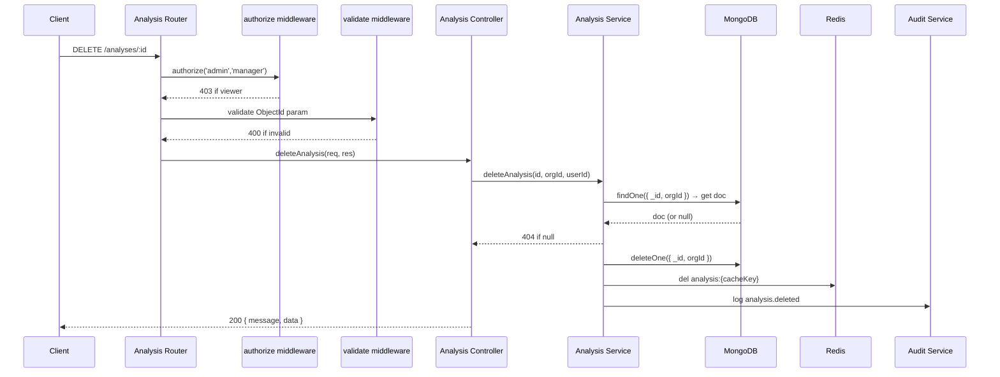

# Design Document: delete-analyses

## Overview

This feature adds hard-delete (permanent) endpoints for AI analysis records. Two new routes are added to the existing analysis router:

- `DELETE /api/v1/analyses/:id` — permanently delete a single analysis by ID
- `DELETE /api/v1/analyses/contract/:contractId` — permanently delete all analyses for a contract

Both routes are gated behind `authorize('admin', 'manager')` RBAC middleware, enforce org isolation at the service layer, invalidate Redis cache entries, and write audit log entries via the existing `auditService`. No model changes are needed — documents are physically removed with `deleteOne` / `deleteMany`.

No new infrastructure is required. The feature slots entirely into the existing Express → Controller → Service → MongoDB/Redis/Audit pattern.

---

## Architecture



The bulk-delete flow is identical except the service uses `find` + `deleteMany` and emits a single `analysis.bulk_deleted` audit entry with the affected count.

---

## Components and Interfaces

### Analysis Router (`src/routes/analysis.routes.js`)

Two new routes added, with the contract-scoped route declared before `/:id` (same ordering rule already in place for GET):

```
DELETE /analyses/contract/:contractId
  middleware: authenticate, requireOrg, authorize('admin','manager'), validate(deleteByContract)
  handler:    analysisController.deleteAnalysesByContract

DELETE /analyses/:id
  middleware: authenticate, requireOrg, authorize('admin','manager'), validate(deleteAnalysis)
  handler:    analysisController.deleteAnalysis
```

### Analysis Validator (`src/validators/analysis.validator.js`)

Two new Joi schemas for param validation:

```js
export const deleteAnalysis = Joi.object({
    id: Joi.string().hex().length(24).required(),
});

export const deleteByContract = Joi.object({
    contractId: Joi.string().hex().length(24).required(),
});
```

Both schemas validate route params (not body), so the `validate` middleware must target `req.params`.

### Analysis Controller (`src/controllers/analysis.controller.js`)

Two new thin handler functions:

```js
deleteAnalysis(req, res)
  → calls analysisService.deleteAnalysis(req.params.id, req.orgId, req.user.userId)
  → sendSuccess(res, { message: 'Analysis deleted.', data: { analysisId } })

deleteAnalysesByContract(req, res)
  → calls analysisService.deleteAnalysesByContract(req.params.contractId, req.orgId, req.user.userId)
  → sendSuccess(res, { message: `${count} analysis/analyses deleted.`, data: { deletedCount: count } })
```

### Analysis Service (`src/services/analysis.service.js`)

Two new exported functions:

**`deleteAnalysis(analysisId, orgId, userId)`**
1. `findOne({ _id: analysisId, orgId })` — fetch the doc to read `cacheKey` and confirm existence
2. Throw `AppError('Analysis not found.', 404, 'NOT_FOUND')` if result is null
3. `deleteOne({ _id: analysisId, orgId })` — permanently remove from MongoDB
4. If `doc.cacheKey` exists: `redis.del(REDIS_KEYS.analysis(doc.cacheKey))`
5. `auditService.log({ orgId, userId, action: 'analysis.deleted', resourceType: 'Analysis', resourceId: analysisId })`
6. Return `{ analysisId }`

**`deleteAnalysesByContract(contractId, orgId, userId)`**
1. `find({ contractId, orgId }).select('_id cacheKey').lean()` — collect docs before deletion
2. Extract `cacheKeys` array from results
3. `deleteMany({ contractId, orgId })` — permanently remove all matching documents
4. For each `cacheKey` in `cacheKeys`: `redis.del(REDIS_KEYS.analysis(cacheKey))`
5. `auditService.log({ orgId, userId, action: 'analysis.bulk_deleted', resourceType: 'Analysis', metadata: { contractId, deletedCount: docs.length } })`
6. Return `{ deletedCount: docs.length }`

### Analysis Model (`src/models/Analysis.model.js`)

No changes required. Hard delete physically removes documents, so no soft-delete fields are needed.

---

## Data Models

No model changes are required. Documents are permanently removed from MongoDB — no new fields needed.

### Audit log entries produced

| Action | resourceType | metadata |
|---|---|---|
| `analysis.deleted` | `Analysis` | `{ contractId }` (optional, for traceability) |
| `analysis.bulk_deleted` | `Analysis` | `{ contractId, deletedCount }` |

---

## Correctness Properties

*A property is a characteristic or behavior that should hold true across all valid executions of a system — essentially, a formal statement about what the system should do. Properties serve as the bridge between human-readable specifications and machine-verifiable correctness guarantees.*

### Property 1: Permanent deletion invariant

*For any* analysis document, after a successful delete operation (single or bulk), the document SHALL no longer exist in MongoDB — a subsequent `findOne({ _id: analysisId })` SHALL return null.

**Validates: Requirements 1.2, 2.2**

### Property 2: Cache invalidation on delete

*For any* analysis that has a non-null `cacheKey`, after a successful delete the Redis key `analysis:{cacheKey}` SHALL no longer exist in the cache.

**Validates: Requirements 1.4, 2.3**

### Property 3: Org isolation — cross-org delete returns NOT_FOUND

*For any* analysis belonging to org A, attempting to delete it using org B's context SHALL always result in a `NOT_FOUND` AppError with HTTP status 404, regardless of whether the analysis ID is otherwise valid.

**Validates: Requirements 1.3, 3.1, 3.2**

### Property 4: Invalid ObjectId parameter returns 400

*For any* string that is not a valid 24-character hexadecimal MongoDB ObjectId, sending it as the `:id` or `:contractId` path parameter to either delete route SHALL return HTTP 400 before the request reaches the controller.

**Validates: Requirements 1.7, 2.6**

---

## Error Handling

| Scenario | Layer | Response |
|---|---|---|
| `:id` / `:contractId` is not a valid ObjectId | Router (Joi validator) | 400 `VALIDATION_ERROR` |
| User role is `viewer` | Router (`authorize` middleware) | 403 `FORBIDDEN` |
| Analysis not found or belongs to different org | Service (`AppError`) | 404 `NOT_FOUND` |
| Redis `del` fails | Service (swallowed, logged) | Does not fail the request — cache miss on next read is acceptable |
| Audit log write fails | Audit service (already swallowed) | Does not fail the request — existing behavior |
| MongoDB `deleteMany` fails | Service (propagates) | 500 via global error handler |

Redis cache invalidation failures are intentionally non-fatal. A stale cache entry will simply be a cache miss on the next read, which is safe. This matches the existing pattern in `requestAnalysis`.

---

## Testing Strategy

### Unit / Example Tests

- Controller returns 200 with correct shape for single delete (mocked service)
- Controller returns 200 with `deletedCount` for bulk delete (mocked service)
- Viewer role → 403 on both delete routes
- `deleteAnalysesByContract` with zero matching analyses returns `{ deletedCount: 0 }` without error
- Audit service is called with `analysis.deleted` action on single delete
- Audit service is called once with `analysis.bulk_deleted` and correct count on bulk delete

### Property-Based Tests

Uses [fast-check](https://github.com/dubzzz/fast-check). Each property test runs a minimum of 100 iterations.

**Property 1 — Permanent deletion invariant**
Generate: random valid `analysisId`. Seed a mock Analysis doc. Call `deleteAnalysis`. Assert `findOne({ _id: analysisId })` returns null.

**Property 2 — Cache invalidation on delete**
Generate: random `cacheKey` strings. Pre-populate a mock Redis. Call `deleteAnalysis` / `deleteAnalysesByContract`. Assert `redis.get(REDIS_KEYS.analysis(cacheKey))` returns null for every key.

**Property 3 — Org isolation**
Generate: random `orgIdA`, `orgIdB` (different), random `analysisId` belonging to `orgIdA`. Call `deleteAnalysis(analysisId, orgIdB, userId)`. Assert `NOT_FOUND` AppError is thrown.

**Property 4 — Invalid ObjectId → 400**
Generate: arbitrary strings that are not 24-char hex. Send as path param to both delete routes via supertest. Assert HTTP 400 every time.
