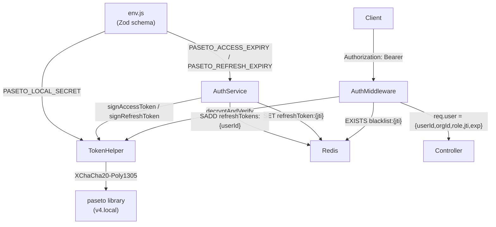

# Design Document: paseto-auth

## Overview

This design replaces the existing `jsonwebtoken`-based authentication with PASETO v4 local tokens using the `paseto` npm library. PASETO v4 local uses XChaCha20-Poly1305 symmetric authenticated encryption, eliminating algorithm-confusion attacks and the `alg: none` exploit class entirely.

The migration is a drop-in replacement at the `tokenHelper.js` layer. All call sites in `auth.service.js` and `auth.middleware.js` keep the same function signatures. Redis key naming, cookie delivery, RBAC, brute-force lockout, OTP flows, and session management are all unchanged.

### Key Design Decisions

- **PASETO v4 local (symmetric)**: Chosen over v4 public (asymmetric) because the API server both issues and verifies tokens — there is no need for third-party verification. Symmetric is simpler and faster.
- **Same function signatures**: `signAccessToken`, `signRefreshToken`, `verifyToken`, `decodeToken`, `getRemainingTTL` are preserved so zero call-site changes are needed.
- **Env var migration**: `JWT_ACCESS_SECRET` / `JWT_REFRESH_SECRET` are replaced by a single `PASETO_LOCAL_SECRET`. Expiry vars are renamed `PASETO_ACCESS_EXPIRY` / `PASETO_REFRESH_EXPIRY`.
- **`@fast-check/jest` already present**: Property-based tests will use the existing dev dependency.

---

## Architecture



### Component Interaction

1. On login, `auth.service.js` calls `signAccessToken` and `signRefreshToken` in `tokenHelper.js`.
2. `tokenHelper.js` uses `paseto` v4.local to encrypt the payload with the symmetric key derived from `PASETO_LOCAL_SECRET`.
3. On every protected request, `auth.middleware.js` calls `verifyToken`, which decrypts and validates the token.
4. The `jti` from the decrypted payload is checked against the Redis blacklist.
5. `req.user` is populated identically to the current JWT implementation.

---

## Components and Interfaces

### `src/utils/tokenHelper.js` (rewritten)

```js
// All signatures preserved — only the internals change

export function signAccessToken(payload, secret, expiresIn)
// Returns: { token: string, jti: string }
// payload: { userId, orgId, role }

export function signRefreshToken(payload, secret, expiresIn)
// Returns: { token: string, jti: string }
// payload: { userId }

export function verifyToken(token, secret)
// Returns: decoded payload object
// Throws: PasetoExpiredError → mapped to TokenExpiredError-like shape
//         PasetoError        → mapped to JsonWebTokenError-like shape

export function decodeToken(token)
// Returns: payload object | null (never throws)
// Decrypts WITHOUT expiry validation — used for TTL calculation at logout

export function getRemainingTTL(exp)
// Returns: number (seconds remaining, minimum 1)
// Unchanged from current implementation
```

**Error mapping**: `auth.middleware.js` currently catches `err.name === 'TokenExpiredError'` and `'JsonWebTokenError'`. The new `verifyToken` will throw errors with the same `.name` values so the middleware requires no changes.

### `src/config/env.js` (updated)

New env vars added to Zod schema:
- `PASETO_LOCAL_SECRET`: `z.string().min(32)` — replaces both JWT secrets
- `PASETO_ACCESS_EXPIRY`: `z.string().default('15m')`
- `PASETO_REFRESH_EXPIRY`: `z.string().default('7d')`

Removed from schema:
- `JWT_ACCESS_SECRET`
- `JWT_REFRESH_SECRET`
- `JWT_ACCESS_EXPIRY`
- `JWT_REFRESH_EXPIRY`
- `JWT_REFRESH_COOKIE_MAX_AGE_MS` → replaced by `PASETO_REFRESH_COOKIE_MAX_AGE_MS`

Production placeholder check updated to include `PASETO_LOCAL_SECRET`.

### `src/services/auth.service.js` (updated call sites only)

- `env.JWT_ACCESS_SECRET` → `env.PASETO_LOCAL_SECRET`
- `env.JWT_REFRESH_SECRET` → `env.PASETO_LOCAL_SECRET`
- `env.JWT_ACCESS_EXPIRY` → `env.PASETO_ACCESS_EXPIRY`
- `env.JWT_REFRESH_EXPIRY` → `env.PASETO_REFRESH_EXPIRY`
- `env.JWT_REFRESH_COOKIE_MAX_AGE_MS` → `env.PASETO_REFRESH_COOKIE_MAX_AGE_MS`
- `verifyJwt` import alias → `verifyToken` (same function, renamed import alias)

### `src/middleware/auth.middleware.js` (no changes required)

The middleware already catches errors by `.name`. The new `tokenHelper.js` maps PASETO errors to the same names. No code changes needed.

### `src/middleware/rbac.middleware.js` (no changes required)

Reads `req.user.role` — unchanged.

---

## Data Models

### PASETO v4 Local Token Payload

Access token payload (encrypted inside the PASETO envelope):
```json
{
  "userId": "<MongoDB ObjectId string>",
  "orgId":  "<MongoDB ObjectId string | null>",
  "role":   "admin | manager | user",
  "jti":    "<UUID v4>",
  "exp":    1234567890
}
```

Refresh token payload:
```json
{
  "userId": "<MongoDB ObjectId string>",
  "jti":    "<UUID v4>",
  "exp":    1234567890
}
```

### PASETO Token Wire Format

```
v4.local.<base64url-encoded-ciphertext>
```

The `paseto` library handles encoding/decoding. The token is opaque to clients — they cannot read the payload without the symmetric key.

### Redis Key Schema (unchanged)

| Key | Type | Value | TTL |
|-----|------|-------|-----|
| `blacklist:{jti}` | string | `"1"` | remaining token lifetime |
| `refreshToken:{jti}` | string | `userId` | refresh token lifetime |
| `refreshTokens:{userId}` | set | set of JTIs | rolling (latest token TTL) |
| `emailOtp:{userId}` | string | 6-digit OTP | 10 minutes |
| `pwReset:{token}` | string | `userId` | 1 hour |
| `login:fail:{email}` | string | failure count | 15 minutes |
| `login:lockout:{email}` | string | `"1"` | 15 minutes |

### Environment Variables

| Variable | Replaces | Default | Notes |
|----------|----------|---------|-------|
| `PASETO_LOCAL_SECRET` | `JWT_ACCESS_SECRET` + `JWT_REFRESH_SECRET` | — | Required, min 32 chars |
| `PASETO_ACCESS_EXPIRY` | `JWT_ACCESS_EXPIRY` | `15m` | |
| `PASETO_REFRESH_EXPIRY` | `JWT_REFRESH_EXPIRY` | `7d` | |
| `PASETO_REFRESH_COOKIE_MAX_AGE_MS` | `JWT_REFRESH_COOKIE_MAX_AGE_MS` | `604800000` | 7 days in ms |


---

## Correctness Properties

*A property is a characteristic or behavior that should hold true across all valid executions of a system — essentially, a formal statement about what the system should do. Properties serve as the bridge between human-readable specifications and machine-verifiable correctness guarantees.*

### Property 1: Token payload round-trip

*For any* valid payload `{ userId, orgId, role }`, calling `signAccessToken` then `verifyToken` with the same secret should return a payload containing all original fields plus a UUID v4 `jti` and a numeric `exp`. Likewise, *for any* `{ userId }`, calling `signRefreshToken` then `verifyToken` should return `userId`, a UUID v4 `jti`, and a numeric `exp`.

**Validates: Requirements 1.1, 1.2, 1.3, 2.1**

---

### Property 2: Token expiry is set correctly

*For any* payload and configured expiry string (e.g. `"15m"`, `"7d"`), the `exp` claim in the decrypted token should be approximately `Math.floor(Date.now()/1000) + parsedSeconds(expiry)` within a 5-second tolerance.

**Validates: Requirements 1.4, 1.5**

---

### Property 3: Wrong key cannot verify token

*For any* token signed with key A, calling `verifyToken` with a different key B should throw an error (not return a payload).

**Validates: Requirements 1.6**

---

### Property 4: Invalid tokens are rejected

*For any* string that is not a valid PASETO v4 local token (random strings, JWT strings, empty strings, truncated tokens), `verifyToken` should throw an error whose `.name` is `'JsonWebTokenError'` (for compatibility with the existing middleware error handler).

**Validates: Requirements 2.4, 8.1**

---

### Property 5: decodeToken never throws

*For any* input string (valid token, expired token, JWT, random garbage, empty string), `decodeToken` should never throw — it should return the payload object or `null`.

**Validates: Requirements 9.1, 9.2**

---

### Property 6: getRemainingTTL returns positive minimum

*For any* Unix epoch `exp` value in the past, `getRemainingTTL` should return `1`. *For any* `exp` value in the future, it should return a positive number equal to `exp - Math.floor(Date.now()/1000)`.

**Validates: Requirements 9.3**

---

### Property 7: Env schema rejects weak or missing PASETO_LOCAL_SECRET

*For any* value of `PASETO_LOCAL_SECRET` that is absent, empty, or shorter than 32 characters, the Zod env schema should fail validation. *For any* production environment where `PASETO_LOCAL_SECRET` contains a placeholder pattern (`"change-me"`, `"secret"`, etc.), the startup check should reject it.

**Validates: Requirements 7.2, 7.4**

---

## Error Handling

| Scenario | Error thrown by `verifyToken` | Middleware response |
|----------|-------------------------------|---------------------|
| Token expired | `{ name: 'TokenExpiredError' }` | 401 `TOKEN_EXPIRED` |
| Invalid structure / wrong key / JWT input | `{ name: 'JsonWebTokenError' }` | 401 `INVALID_TOKEN` |
| JTI in Redis blacklist | — (checked after verify) | 401 `TOKEN_REVOKED` |
| Missing/empty Authorization header | — (checked before verify) | 401 `UNAUTHORIZED` |

**Error name compatibility**: The `paseto` library throws `PasetoExpiredError` and `PasetoError`. `tokenHelper.verifyToken` catches these and re-throws with `.name` set to `'TokenExpiredError'` and `'JsonWebTokenError'` respectively, so `auth.middleware.js` requires zero changes.

**`decodeToken` contract**: Always returns `null` on any failure — never throws. This is critical because it is called during logout to compute blacklist TTL, and a throw there would prevent logout from completing.

**Startup validation**: `env.js` Zod schema fails fast on missing/short `PASETO_LOCAL_SECRET`. Production placeholder check is extended to include `PASETO_LOCAL_SECRET`.

---

## Testing Strategy

### Dual Testing Approach

Both unit tests and property-based tests are required. They are complementary:
- Unit tests cover specific examples, integration points, and error conditions.
- Property tests verify universal correctness across randomly generated inputs.

### Property-Based Testing

Library: **`@fast-check/jest`** (already in `devDependencies`).

Each property test runs a minimum of **100 iterations**.

Tag format: `// Feature: paseto-auth, Property N: <property_text>`

| Property | Test file | PBT library call |
|----------|-----------|-----------------|
| P1: Token payload round-trip | `tests/unit/utils/tokenHelper.test.js` | `fc.property(fc.record({userId, orgId, role}), ...)` |
| P2: Token expiry is set correctly | `tests/unit/utils/tokenHelper.test.js` | `fc.property(fc.constantFrom('15m','7d','1h'), ...)` |
| P3: Wrong key cannot verify | `tests/unit/utils/tokenHelper.test.js` | `fc.property(fc.string({minLength:32}), fc.string({minLength:32}), ...)` |
| P4: Invalid tokens are rejected | `tests/unit/utils/tokenHelper.test.js` | `fc.property(fc.string(), ...)` |
| P5: decodeToken never throws | `tests/unit/utils/tokenHelper.test.js` | `fc.property(fc.string(), ...)` |
| P6: getRemainingTTL returns positive minimum | `tests/unit/utils/tokenHelper.test.js` | `fc.property(fc.integer(), ...)` |
| P7: Env schema rejects weak secrets | `tests/unit/config/env.test.js` | `fc.property(fc.string({maxLength:31}), ...)` |

### Unit Tests

File: `tests/unit/utils/tokenHelper.test.js`
- Access token contains all required claims (example)
- Refresh token contains required claims (example)
- Expired token throws `TokenExpiredError` (edge case)
- JWT string is rejected with `JsonWebTokenError` (example — Req 8.1)
- `decodeToken` on expired token returns payload without throwing (example — Req 9.1)
- `decodeToken` on garbage returns `null` (example — Req 9.2)

File: `tests/unit/config/env.test.js`
- Missing `PASETO_LOCAL_SECRET` fails validation (example — Req 7.2)
- Short `PASETO_LOCAL_SECRET` fails validation (example — Req 7.2)
- Valid 32-char secret passes validation (example)
- JWT vars absent from schema (example — Req 8.2)
- Default expiry values are applied (example — Req 7.3)

File: `tests/unit/middleware/auth.middleware.test.js`
- Valid token → `req.user` populated, `next()` called (example — Req 2.5)
- Blacklisted JTI → 401 `TOKEN_REVOKED` (example — Req 2.3)
- Expired token → 401 `TOKEN_EXPIRED` (example — Req 2.2)
- Invalid token string → 401 `INVALID_TOKEN` (example — Req 2.4)
- Missing header → 401 `UNAUTHORIZED` (example)
